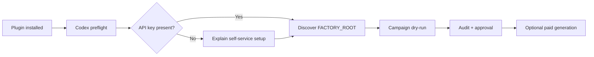

# LinkedIn Ad Asset Factory for Codex

> A Codex-only plugin that walks through setup, then runs an approval-gated B2B LinkedIn ad asset workflow.

[](./plugins/linkedin-ad-asset-factory/.codex-plugin/plugin.json)
[](./plugins/linkedin-ad-asset-factory/skills/linkedin-ad-asset-factory/SKILL.md)

This repository is a **Codex plugin marketplace** containing one skill: `linkedin-ad-asset-factory`.

The plugin is designed to do two things in order:

1. walk through the local initial setup without handling secret values;
2. operate or build a B2B LinkedIn ad asset factory using dry-runs, audits, approval gates, and structured artifacts.

## One-command local setup

Clone this repository, then run the bootstrap. It registers the repository as a local Codex marketplace and installs the bundled plugin automatically.

```powershell
git clone https://github.com/GMyoung/Linkedin-Ad-Asset-Factory-Skill.git
cd Linkedin-Ad-Asset-Factory-Skill
python .\plugins\linkedin-ad-asset-factory\scripts\bootstrap_codex.py --install-plugin --json
```

Then start a **new Codex task** and say:

```text
Use $linkedin-ad-asset-factory to complete the initial setup walkthrough.
```

The bootstrap is idempotent. It will not silently replace a marketplace with the same name from a different local path.

## API key setup

You need an OpenAI API key only for real image generation. Do not paste it into Codex chat.

1. Create a key in the [OpenAI API key dashboard](https://platform.openai.com/api-keys).
2. Save it for your Windows user without echoing it:

   ```powershell
   $key = Read-Host "Paste your OpenAI API key"
   [Environment]::SetEnvironmentVariable("OPENAI_API_KEY", $key, "User")
   Remove-Variable key
   ```

3. Restart Codex completely.
4. Run the setup walkthrough again. It reports only whether the key is present.

Dry-run works without a key. The skill will not begin real image generation until the key is available, the copy audit passes, and you explicitly approve it.

## What happens on first use



Preflight checks the Codex CLI, plugin state, optional `FACTORY_ROOT`, and the presence of `OPENAI_API_KEY`. It never reads or prints the key.

## Skill scope

The bundled skill supports:

- initial Codex/plugin/API-key walkthrough;
- layered campaign intake from URLs, PDFs, images, text, brand guides, and factual evidence;
- pattern/visual selection and structured variant planning;
- dry-run briefs, visible-copy review, and audit artifacts;
- explicit approval before real generation;
- selected-asset revisions that preserve approved work;
- Markdown export and optional Drive handoff;
- modular factory changes, including file-based taxonomy extensions.

It runs only in Codex CLI or the Codex desktop harness. Other agent runtimes are intentionally unsupported.

## Project layout

```text
.
├── .agents/plugins/marketplace.json
├── plugins/linkedin-ad-asset-factory/
│   ├── .codex-plugin/plugin.json
│   ├── scripts/bootstrap_codex.py
│   └── skills/linkedin-ad-asset-factory/
│       ├── SKILL.md
│       ├── agents/openai.yaml
│       └── references/
└── README.md
```

## Safety

- Never paste or commit API keys, tokens, passwords, or private keys.
- Default to dry-run; real generation requires explicit approval.
- Do not copy third-party ads or invent claims, endorsements, statistics, or customer evidence.
- Do not use bot-protection, captcha, blocked, or error pages as campaign sources.

## Validate locally

```powershell
python .\plugins\linkedin-ad-asset-factory\scripts\bootstrap_codex.py --check-only --json
codex plugin list --marketplace linkedin-ad-asset-factory --available --json
```

Maintainers should additionally validate the plugin manifest and `SKILL.md` with their Codex skill/plugin tooling before publishing.
