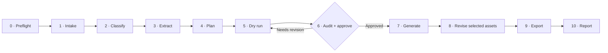

# LinkedIn Ad Asset Factory Skill

> Turn mixed campaign inputs into an auditable, approval-gated workflow for B2B LinkedIn ad assets.

[](./SKILL.md)
[](https://developers.openai.com/codex/skills)
[](./references/architecture.md)

This repository contains one reusable Agent Skill that teaches Codex and compatible coding agents how to **build, modify, operate, review, and recover** a B2B LinkedIn ad image asset factory.

It combines two concerns that are often split apart:

- the **factory contract**: layered source ingestion, design/content profiles, creative taxonomy, structured briefs, prompt assembly, image generation, QA, and extensibility;
- the **operator workflow**: intake, dry-run, approval, paid generation, per-asset revision, export, and Google Drive handoff.

The result is one entry point, one vocabulary, and one Stage 0–10 workflow.

> [!IMPORTANT]
> This repository is the **Agent Skill**, not the complete Python asset-factory application. The skill can discover and operate an existing implementation, guide changes to one, or scaffold the modular target when the user asks to build it.

## Why this skill

LinkedIn ad generation is easy to reduce to “write many similar prompts.” This skill adds the structure needed for repeatable campaign work:

- keeps design sources, campaign copy, references, brand assets, and factual evidence separate;
- selects stable creative patterns (`P01–P65`) and visual vocabularies (`V01–V20`) before producing variants;
- makes every visible headline, subheadline, CTA, statistic, quote, callout, and disclaimer reviewable before image generation;
- defaults to dry-run and requires an approval gate before paid generation;
- preserves approved briefs during generation and selected-asset revisions;
- records source provenance, decision reasons, prompts, failures, QA, and exports;
- supports file-based custom pattern and visual definitions without ordinary Python edits;
- refuses blocked/captcha pages as creative evidence and never stores credentials.

## Install

### With the open Agent Skills CLI

Install globally for Codex:

```bash
npx skills add GMyoung/Linkedin-Ad-Asset-Factory-Skill -g -a codex
```

Install into the current project instead:

```bash
npx skills add GMyoung/Linkedin-Ad-Asset-Factory-Skill -a codex
```

List the skill before installing:

```bash
npx skills add GMyoung/Linkedin-Ad-Asset-Factory-Skill --list
```

### Manual Codex installation

macOS/Linux:

```bash
git clone https://github.com/GMyoung/Linkedin-Ad-Asset-Factory-Skill.git \
  "${CODEX_HOME:-$HOME/.codex}/skills/linkedin-ad-asset-factory"
```

Windows PowerShell:

```powershell
git clone https://github.com/GMyoung/Linkedin-Ad-Asset-Factory-Skill.git `
  "$HOME\.codex\skills\linkedin-ad-asset-factory"
```

Restart or open a new agent session after manual installation so the skill catalog is refreshed.

## Quick start

Invoke the skill explicitly:

```text
Use $linkedin-ad-asset-factory to turn this landing-page URL and brand guide into
five B2B LinkedIn ad briefs. Stop after the dry-run and show me the copy audit.
```

Build or refactor a factory:

```text
Use $linkedin-ad-asset-factory to scaffold a modular Python factory in this repo.
Keep taxonomy extensions file-based and add the dry-run acceptance tests.
```

Operate an existing implementation:

```text
Use $linkedin-ad-asset-factory to find the local factory, ingest these campaign
files, run a dry-run, resolve audit failures, and wait for approval before images.
```

Revise a selected asset:

```text
Use $linkedin-ad-asset-factory to revise asset_004 only. Preserve its composition,
use the existing generated image as edit input, and keep the other assets unchanged.
```

## Workflow



Paid image generation is never the default. The agent should stop at the dry-run unless the user explicitly authorizes real generation and the audit/approval gate passes.

## Three working modes

| Mode | Use it for | Typical result |
|---|---|---|
| **Operate** | Run an existing factory from campaign intake to export | Dry-run or approved image set |
| **Build or modify** | Scaffold or change the reusable factory implementation | Code, tests, and verified workflow changes |
| **Review or recover** | Audit outputs, repair failures, revise selected assets, or resume a run | Corrected artifacts without restarting valid stages |

The skill discovers the factory implementation from the user-provided path, current directory, or workspace entrypoints. It refers to the selected implementation as `FACTORY_ROOT` instead of hardcoding a machine-specific location.

## Inputs

The skill keeps these source roles separate:

```yaml
sources:
  design_sources: []
  content_sources: []
  generation_requirements: []
  reference_examples: []
  brand_assets: []
  factual_evidence: []
```

Supported campaign material can include URLs, PDFs, images, Markdown/TXT, brand guides, design-system pages, approved ad examples, campaign briefs, logos, and claim evidence.

## Expected dry-run artifacts

An implementation guided by this skill should expose reviewable artifacts before paid generation:

```text
out/linkedin_ads/
├── asset_plan.json
├── on_image_text_plan.json
├── copy_review.md
├── dry_run_audit.json
├── dry_run_audit.md
├── preview.html
├── briefs/
├── prompts/
└── generation_report.md
```

The audit should detect source fragments, website UI noise, sample domains, blocked-page text, encoding artifacts, visible-copy word-budget failures, unverified claims, and loss of the source message.

## Creative taxonomy

The built-in vocabulary contains:

- **65 content patterns** for reports, guides, product workflows, ROI, customer stories, events, carousels, awareness concepts, retargeting, and more;
- **20 visual vocabularies** for big type, report mockups, UI frames, charts, diagrams, portraits, quote cards, event posters, and physical experiences;
- registry-driven pairings, required-fact checks, compatibility rules, scored selection reasons, and custom `P_CUSTOM_*` / `V_CUSTOM_*` definitions.

See [the taxonomy reference](./references/taxonomy.md) for the stable IDs and selection rules.

## Repository structure

```text
.
├── README.md                    # Human-facing project overview
├── SKILL.md                     # Agent entry point and stage gates
├── agents/
│   └── openai.yaml              # Codex skill-list metadata
└── references/
    ├── workflow.md              # Operational Stage 0–10 details
    ├── architecture.md          # Factory modules and data contracts
    ├── taxonomy.md              # P/V vocabulary and extension rules
    └── qa-and-safety.md         # Audits, outputs, failures, and tests
```

`SKILL.md` stays concise and routes the agent to only the reference needed for the current task. This follows the progressive-disclosure model used by mature Agent Skill collections.

## Image API boundary

For a compatible OpenAI-backed implementation, the skill requires:

- configurable image model, defaulting to `gpt-image-2`;
- `client.images.generate` for normal text-to-image work;
- `result.data[0].b64_json` for returned image bytes;
- no `response_format` argument for GPT Image models;
- image editing only when an existing image or explicit reference image is part of the task;
- `OPENAI_API_KEY` from the process environment or a gitignored `.env`.

The skill contains no API key and should never write secret values into source, briefs, manifests, reports, docs, logs, chat, or indexes.

## Safety and quality gates

The workflow prohibits:

- copying a third-party ad's exact layout, image, character, wording, or distinctive trade dress;
- using logos, people, endorsements, testimonials, partnerships, awards, or customer names without supplied rights and evidence;
- inventing statistics or other factual claims;
- using captcha, bot-protection, access-denied, or error pages as campaign evidence;
- generating fake LinkedIn controls or deceptive news interfaces;
- skipping audit and approval before real generation.

See [QA and safety](./references/qa-and-safety.md) for acceptance tests and failure behavior.

## Validation

The repository is checked with:

```bash
python /path/to/skill-creator/scripts/quick_validate.py .
npx skills add . --list
git diff --check
```

Publication checks also cover internal reference links and common secret/private-key patterns.

## Design influences

The README structure and packaging approach draw from established Agent Skill repositories:

- [Anthropic Skills](https://github.com/anthropics/skills) for the simple `SKILL.md` contract, examples, and invocation model;
- [Vercel Skills](https://github.com/vercel-labs/skills) for cross-agent installation and discovery through `npx skills`;
- [Awesome GitHub Copilot](https://github.com/github/awesome-copilot) for human-facing catalogs, clear capability summaries, bundled-resource visibility, and progressive disclosure.

This repository remains a standalone skill rather than a catalog, so the README prioritizes one install command, one workflow, and concrete prompts.

## Contributing

Contributions should keep the agent contract auditable and context-efficient:

1. Keep `SKILL.md` focused on routing and non-negotiable workflow rules.
2. Put detailed domain rules in a directly linked file under `references/`.
3. Preserve the dry-run and approval gates.
4. Add or update acceptance checks when behavior changes.
5. Run skill validation, link checks, secret scanning, and `git diff --check` before publishing.

## 中文简介

这是一个面向 Codex 和兼容 Agent 的 B2B LinkedIn 广告资产工作流 skill。它把“搭建/修改广告工厂”和“日常操作广告工厂”统一为一个入口，通过 Stage 0–10 管理资料输入、来源分类、设计提取、创意规划、dry-run、审核批准、真实生成、单资产修订、导出和最终报告。

默认只进行 dry-run；只有用户明确批准且审核通过后，才允许真实图片生成。该仓库不包含完整 Python 工厂，也不保存任何 API key。
